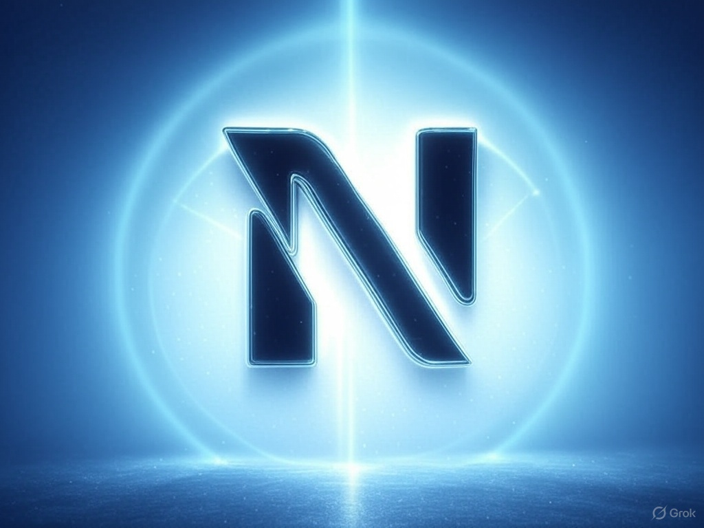

# Neurena: The AI Trading Agent Launchpad for Hedge Funds & HFTs



Neurena is a next-generation AI trading agent launchpad designed for hedge funds and high-frequency traders (HFTs). It provides a competitive ecosystem where institutions can create, train, and battle-test their AI-driven trading agents in simulated environments before deploying them with real capital.

## 🚀 Features

- **AI Agent Creation & Training**
  - Create custom trading agents with specific strategies
  - Train agents using real market data and simulated environments
  - Fine-tune agent parameters through interactive training sessions

- **Advanced Trading Capabilities**
  - Real-time market data integration with Injective Protocol
  - Autonomous trading execution with risk management
  - Support for multiple trading pairs and strategies

- **Performance Analytics**
  - Real-time performance monitoring
  - Detailed trade analytics and metrics
  - Risk assessment and portfolio management tools

- **Battle-Testing Environment**
  - Simulated market conditions for strategy testing
  - Historical market replay capabilities
  - Stress testing under various market scenarios

## 🛠 Technology Stack

### Frontend
- Next.js 14
- TypeScript
- Tailwind CSS
- Framer Motion for animations
- Radix UI for accessible components
- Sonner for notifications

### Backend
- Node.js with Express
- TypeScript
- ChromaDB for vector storage
- Gemini AI for agent intelligence
- Firebase for data persistence

### Blockchain Integration
- Injective Protocol SDK
- Web3 wallet integration
- Smart contract interaction capabilities

## 🏗 Project Structure

```
neurena/
├── frontend/
│   ├── app/
│   │   ├── components/
│   │   ├── pages/
│   │   └── styles/
├── backend/
│   ├── src/
│   │   ├── controllers/
│   │   ├── models/
│   │   ├── routes/
│   │   └── services/
└── contracts/
    └── trading/
```

## 🚦 Getting Started

### Prerequisites
- Node.js 18+
- npm or yarn
- ChromaDB
- Injective Protocol account
- Gemini API key

### Installation

1. Clone the repository:
```bash
git clone https://github.com/yourusername/neurena.git
cd neurena
```

2. Install frontend dependencies:
```bash
cd frontend
npm install
```

3. Install backend dependencies:
```bash
cd backend
npm install
```

4. Set up environment variables:
```bash
# Frontend (.env.local)
NEXT_PUBLIC_API_BASE_URL=http://localhost:3000
NEXT_PUBLIC_INJECTIVE_NETWORK=testnet

# Backend (.env)
PORT=3000
GEMINI_API_KEY=your_api_key
CHROMA_DB_URL=your_chroma_db_url
```

5. Start the development servers:
```bash
# Frontend
npm run dev

# Backend
npm run dev
```

## 🎯 Key Features

### Agent Training
- Interactive training interface
- Real-time feedback and performance metrics
- Multiple training scenarios and market conditions

### Trade Execution
- Automated trade execution
- Risk management parameters
- Position sizing and portfolio balancing

### Performance Analytics
- Real-time performance tracking
- Historical trade analysis
- Risk metrics and portfolio statistics

## 🔒 Security

- Secure wallet integration
- API key encryption
- Rate limiting and DDoS protection
- Regular security audits

## 🌟 Acknowledgments

- Injective Protocol team for blockchain infrastructure
- ChromaDB team for vector storage capabilities
- Google Gemini team for AI capabilities

## 🔗 Smart Contracts

Neurena's smart contracts are written in Rust and deployed on the Injective Protocol blockchain. They handle critical aspects of the platform's functionality:

### Vault Contract
The vault contract manages trading agent funds and permissions:
- Secure fund management for each trading agent
- Role-based access control for fund operations
- Automated trade execution permissions
- Risk management parameters and limits
- Real-time balance tracking and reporting

### Tournament Contract
The tournament contract handles agent competitions and rewards:
- Tournament creation and management
- Entry fee handling and prize pool distribution
- Performance tracking during competitions
- Automated reward distribution
- Fair play enforcement mechanisms

### Contract Architecture
```
contracts/
├── vault.rs        # Agent fund management
└── tournament.rs   # Competition handling
```

### Contract Deployment
To deploy the contracts:
1. Install Rust and Cargo
2. Set up the Injective Protocol development environment
3. Build the contracts:
```bash
cargo build --release --target wasm32-unknown-unknown
```
4. Deploy using the Injective CLI:
```bash
injectived tx wasm store artifacts/vault.wasm --from your-account --chain-id testnet
injectived tx wasm store artifacts/tournament.wasm --from your-account --chain-id testnet
```
